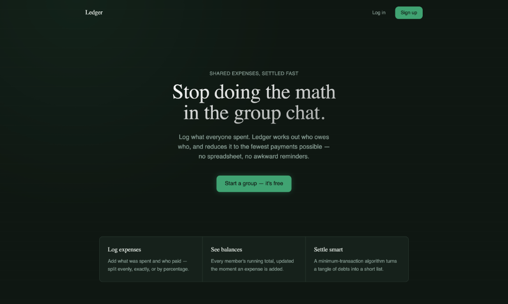
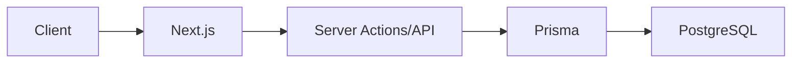

# Ledger — Expense Splitter

> A full-stack expense-sharing platform with group management, automated balance calculation, and optimized debt settlement.

🚀 **Live Demo:** [https://splitwise-clone-og5u-f3enfoatn.vercel.app/](https://splitwise-clone-og5u-f3enfoatn.vercel.app/)



## Features

- **Create groups:** Organize expenses by trip, household, or event.
- **Add expenses:** Log shared costs quickly and easily.
- **Split expenses:** Split equally, by exact amounts, or by percentage.
- **View balances:** See exactly who owes whom at a glance.
- **Settle debts:** Record payments to clear out balances.
- **Authentication:** Secure email/password login.

## Tech Stack


## Architecture



## How it works

1. **Add an Expense**: A user adds an expense, specifying who paid and how it's split.
2. **Calculate Shares**: The server computes the exact share for each member based on the split type.
3. **Update Balances**: Each member's running net balance is updated in the database.
4. **Simplify Debts**: The greedy algorithm computes the minimum number of transactions needed to settle all positive and negative balances.
5. **Settle Up**: Users record payments, updating balances and recalculating the simplified debt graph.

## Debt Simplification Algorithm

Finding the true *minimum* number of transactions to settle a set of balances is NP-hard (it's equivalent to a set-partition problem). The application uses a greedy "largest debtor pays largest creditor" heuristic that runs in O(n log n). It is easy to reason about and test, and gets very close to optimal for realistic group sizes.

## Testing / CI

We have robust testing and CI/CD pipelines in place:
- ✓ Unit tests
- ✓ Type checking
- ✓ ESLint
- ✓ Production build checks
- ✓ Database migration checks

## Getting started

### 1. Clone and install

```bash
git clone https://github.com/Meloxy-tech/splitwise-clone
cd splitwise-clone
npm install
```

### 2. Set up a free Postgres database

Pick one:
- **[Supabase](https://supabase.com)** — new project → Settings → Database → copy the connection string (use the "connection pooling" string for serverless deployment)
- **[Neon](https://neon.tech)** — new project → copy the connection string from the dashboard

### 3. Configure environment variables

```bash
cp .env.example .env
```

Fill in:
- `DATABASE_URL` — from step 2
- `NEXTAUTH_SECRET` — generate with `openssl rand -base64 32`
- `NEXTAUTH_URL` — `http://localhost:3000` for local dev

### 4. Set up the database

```bash
npm run prisma:migrate    # creates tables
npm run prisma:seed       # optional: adds demo users/group/expenses
```

### 5. Run it

```bash
npm run dev
```

Visit `http://localhost:3000`.

## Roadmap

- [ ] Expense editing
- [ ] Group invitations
- [ ] Notifications
- [ ] Expense attachments
- [ ] Payment integration
- [ ] Mobile optimization
